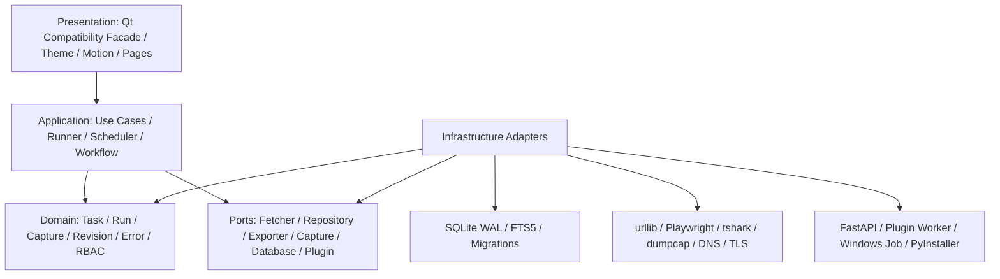
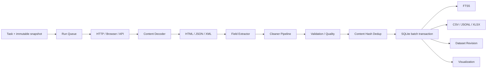
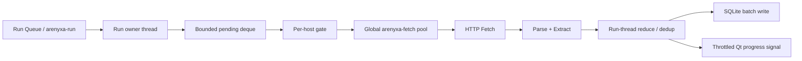
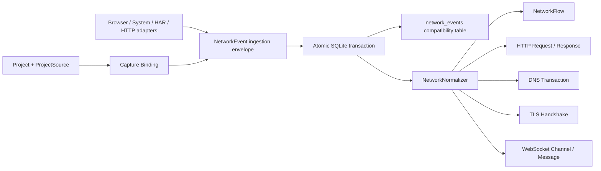
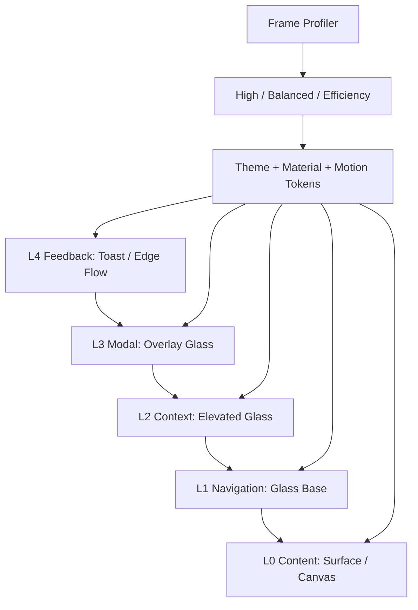
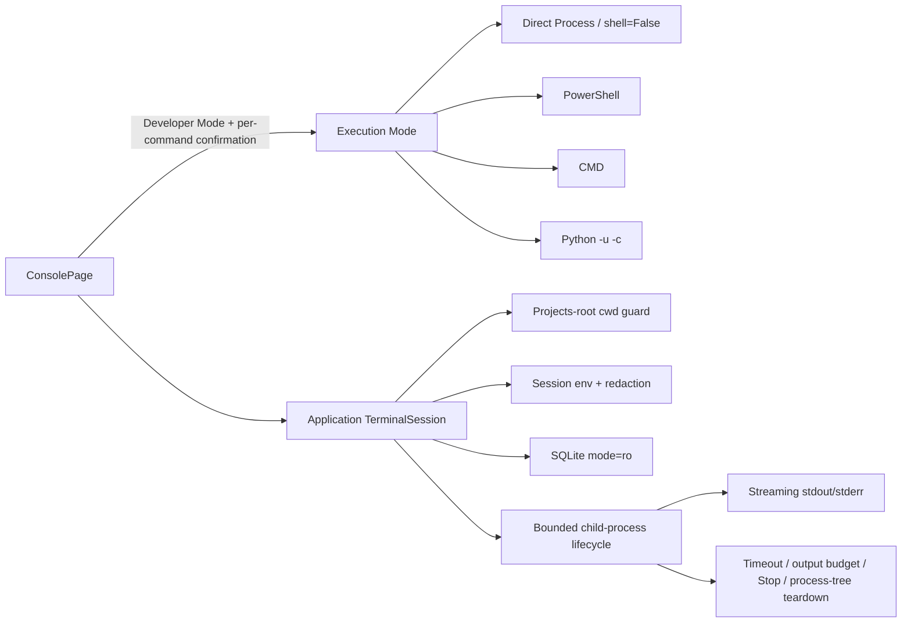
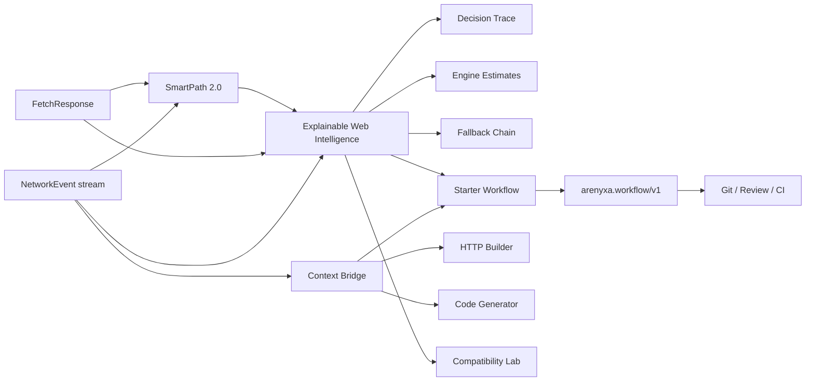
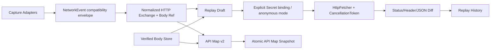
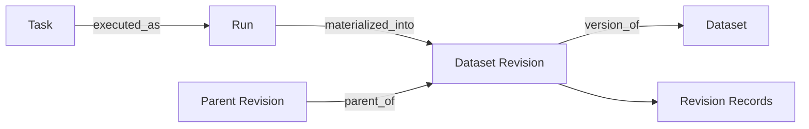
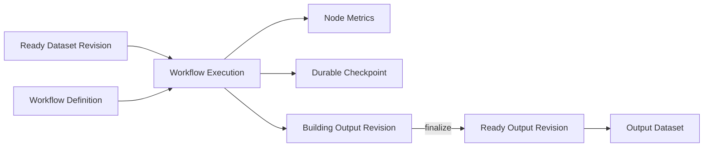

# Arenyxa V8.0 软件架构

## 分层与依赖方向



UI 不直接访问网络库；页面通过 Application Service 发起用例。SQLite repository 是当前基础适配器，通用数据库、Browser、Packet、Server 和 Plugin 均为可替换适配器。

## 采集与数据流



## HTTP 多 URL 并发与背压



`run_workers` 控制独立 Run 并发，`request_workers` 控制进程级 HTTP/Parse/Extract 并发，`per_host_workers` 同时在 Run 内和进程级限制同一 Host。Worker 不直接修改 Run 状态或写 SQLite；只有 Run owner 归并 Future 结果并批量提交数据库。URL 数量很大时只维持有限 in-flight Future，避免 ThreadPoolExecutor 无界任务队列造成内存峰值。Pause/Resume/Cancel 使用线程安全协作令牌。

## Network Capture 并发与背压

```mermaid
sequenceDiagram
  participant A as Browser/System/HAR Adapter
  participant C as CaptureController
  participant Q as Bounded Event Queue
  participant W as Traffic Writer
  participant DB as TrafficStore
  participant UI as Network Model
  A->>C: NetworkEvent
  C->>C: pre-filter + sensitivity flags
  alt queue has capacity
    C->>Q: enqueue
  else queue full
    C->>C: dropped_events += 1
  end
  W->>Q: batch dequeue (<=500 / 200ms)
  W->>DB: transaction commit metadata
  W-->>UI: throttled visible batch
  Note over A,DB: dumpcap stores pcapng ring chunks; HTTPS payload stays encrypted
```

## V6.1 Unified Network Core



`NetworkEvent` remains the adapter/UI compatibility envelope, but it is no longer the long-term analytical model. V6.1 deterministically projects each accepted event into normalized entities in the **same transaction** as the legacy row. Stable request/flow IDs therefore become a safe foundation for V6.2 capture enrichment, V6.3 Replay/API Map, and later Dataset lineage without forcing an all-at-once adapter rewrite.

## 持久化对象

- `Task`, `Run`, `ResultRecord`, `Schedule`, `ExportJob`
- `Project`, `ProjectSource`, `CaptureSession`, `CaptureBinding`, `NetworkEvent`, `CaptureChunk`
- `NetworkFlow`, `HttpRequestRecord`, `HttpResponseRecord`, `DnsTransaction`, `TlsHandshake`, `WebSocketChannel`, `WebSocketMessage`
- `DatasetRevision`, `RevisionRecord`
- `Workflow`, `Visualization`, `BrowserProfile`, `Plugin`
- `Workspace`, `WorkspaceMember`, `AuditLog`
- `Settings`, `SchemaMigration`, `LocalSearch`

所有稳定事实使用 UUID 前缀 ID；JSON 对象用于可扩展配置，关系/查询字段保持结构化列。数据库迁移是单向可审计链，备份/恢复在写入前校验版本和内容。

## 视觉合成



Windows 11 尝试 DWM backdrop；不可用时使用半透明 Qt 材质，Reduce Motion/高对比/远程桌面可回退到 Solid。业务线程和 UI 动画互不等待。

V6.5.3 将 L1 Navigation 收敛为 236 px 展开 / 68 px 紧凑的单选 rail。中部仅承载可滚动 Core/Advanced/Developer 导航，Settings/About 固定在非滚动 footer；页面按钮由一个 exclusive `QButtonGroup` 管理，路由提交后再同步视觉选中态。普通可点击项使用中性文字，Accent 只表达当前页面和语义状态，避免“多个绿色项看起来同时被选中”。


## Developer Terminal execution boundary



`TerminalSession` 属于 Application 层且不依赖 Qt；Presentation 只负责 Developer Mode 权限门、逐次确认、模式选择与流式输出渲染。Direct 模式不调用 Shell；PowerShell/CMD 是显式高权限语义入口而不是隐式 `shell=True`。工作目录通过 `Path.resolve()` 后限制在 Projects 根目录，SQL Console 通过 SQLite `mode=ro` 打开数据库。关闭 Developer Mode 使用非阻塞取消请求，应用退出再执行同步终止，避免 GUI 为子进程清理长时间卡住。

## Explainable Web Intelligence and portable context

The competitive-edge layer is implemented in `src/arenyxa/application/competitive.py` and remains Qt-independent. It consumes existing `FetchResponse`, `NetworkEvent`, SmartPath and Workflow domain objects instead of creating a parallel data model.



Heuristic resource/latency figures are always labelled estimates; measured compatibility/performance claims must come from a separately recorded benchmark run. Context conversion omits authentication/cookie material unless code explicitly opts in, and the portable workflow layer rejects likely inline secrets in favor of Secrets Vault references.
## V6.2 Network Capture Enrichment

V6.2 keeps the V6.1 normalized projection boundary and improves the quality of data entering it. Browser and HAR capture can now persist bounded body artifacts through a content-addressed local body store. The database records logical body IDs, original/stored SHA-256 values, original/stored sizes, MIME/encoding, truncation state, sensitivity state, and a capture-relative storage reference. Absolute machine paths are intentionally excluded from normalized HTTP rows.

Browser Capture emits completed HTTP exchanges after `requestfinished`, enriches flows with server endpoint/security details when Playwright exposes them, and emits WebSocket open/frame/close events into the same `NetworkEvent` ingestion envelope. Response payload reads are budgeted and skipped for known oversized resources rather than materializing arbitrarily large bodies.

System Capture negotiates optional tshark fields instead of blindly requiring version-specific dissector fields. It now normalizes TCP/UDP stream IDs, process-informed direction, local/remote endpoints, DNS query type/answers/latency, TLS SNI/cipher/ALPN, and packet timestamps. HAR one-shot imports commit the capture row, legacy events, body metadata, and normalized projections in one transaction.

This capture layer remains the durability boundary consumed by V6.3 Replay/API Map. Replay and API discovery read normalized HTTP identities and verified Body Refs rather than reaching back into adapter-specific transient state.


## V6.2.1 Autopilot Learning integration

Autopilot remains an **advisory, deterministic-feedback layer** above `SmartPathV2`; it does not bypass the existing execution, permission, capture, or validation boundaries. `ExperienceStore` uses a dedicated SQLite/WAL database under the local data root and stores only bounded coarse features, strategy outcomes, selector categories, and failure labels. Raw response bodies, DOM, headers, cookies, tokens, prompts, URL paths/query strings, and raw selector text are intentionally excluded.

The merge keeps V6.1/V6.2 Network Core authoritative. Autopilot currently consumes the compatibility `NetworkEvent` view so the learning branch can be integrated without weakening normalized capture transactions. A later iteration may consume normalized HTTP/Flow entities directly once V6.3 Replay/API Map stabilizes those query contracts.


## V6.3 Replay + API Map

V6.3 moves API discovery and Request Replay onto the normalized V6.1/V6.2 HTTP Exchange contract. `ApiMapService` groups deterministic route signatures, profiles query/pagination parameters, records status/content-type/auth signals, and can infer a bounded JSON response schema from integrity-checked Body Refs. Snapshot persistence is atomic: the snapshot header and all endpoint definitions are committed in one SQLite transaction.

Replay no longer depends on raw adapter state. `CapturedBodyResolver` looks up logical Body IDs in SQLite, constrains reads to the canonical capture directory, and verifies stored size/SHA-256 before a payload can be used. Captured Authorization/Cookie/API-key values are never silently injected into a replay request; sensitive fields become explicit Secret references. A user may bind new values deliberately or drop unresolved sensitive fields for an anonymous replay. Write-like methods retain an explicit side-effect confirmation gate, and truncated request bodies are rejected by default.

Replay results store only a redacted request snapshot, response metadata/hash, and bounded structural comparison. Full replay response bodies are not duplicated into SQLite. JSON comparison records bounded path-level changes while volatile headers are excluded from header-diff noise. Corrupt normalized JSON rows produce stable `NETWORK_CORE_CORRUPT` errors rather than leaking raw decoder exceptions into the UI.




## V6.4 Dataset + Data Lineage

V6.4 promotes collected records from a Run-local implementation detail into a durable, queryable Dataset model. A Dataset owns a sequence of immutable revisions. Revision construction uses an explicit `building -> ready` lifecycle; `interrupted`, `failed`, and `cancelled` revisions remain available for diagnostics/recovery but are hidden from normal history by default. This prevents partially materialized data from being mistaken for a published revision.

`DataLineageService` streams canonical ResultRecords from SQLite and writes revision records in bounded batches. Logical identity can be derived from caller-selected identity fields; when no logical key is supplied, a canonical content hash is used. Later source runs deterministically replace earlier values for the same logical identity during one materialization. Online schema inference is bounded and widens compatible numeric types while marking incompatible observations as mixed rather than attempting unbounded deep inference.



Lineage is persisted as deterministic nodes/edges. Graph traversal is bounded by depth and node count and is cycle-safe. Metadata is structural and bounded: raw bodies, cookies, authorization headers, tokens, and other captured secret-bearing payloads are not copied into lineage metadata. Database migration and recovery are separated from legacy Run/Capture recovery so older callers retain their exact compatibility contract.

## V6.5 Workflow Engine Integration

V6.5 connects Dataset revisions to the existing deterministic Workflow Engine without creating a second execution model. The runtime consumes one immutable source record at a time, invokes the existing Workflow Engine, buffers only a bounded number of outputs, and persists progress using keyset checkpoints. The output is built as a new hidden Dataset revision and becomes visible only after finalization.



For resumability, output identities are deterministic over source identity, workflow identity, and output ordinal. Re-executing an uncheckpointed source item therefore replaces the same staged rows instead of duplicating them. An execution stores a semantic definition hash covering workflow identity/version/schema/nodes while excluding provenance timestamps; resume is rejected if the executable definition changed. Cancellation checkpoints only completed source inputs, marks the execution/revision as cancelled, and leaves the staged revision eligible for an explicit resume operation.

Node-level counters are accumulated in `workflow_node_executions`. End-to-end lineage records source Revision -> Workflow Execution, Workflow -> Execution, Execution -> output Revision, parent Revision -> output Revision, and output Revision -> Dataset. Active executions found after an unclean shutdown are changed to `interrupted`; building revisions are similarly marked interrupted rather than silently published.

## V6.5.3 Startup Diagnostics, Motion and i18n Hardening

V6.5.3 moves the normal startup health scan behind the first visible MainWindow frame and executes it as a background UI job. Any detected issue is therefore presented in the context of the running application and is parented to the main window. Bootstrap failures that prevent normal workspace creation enter a minimal Recovery Mode shell before the repair prompt is shown. A missing Qt dependency remains the sole native pre-UI recovery path because a Qt surface cannot be constructed without Qt.

Navigation transitions no longer animate geometry of layout-managed pages. `MotionOrchestrator.transition_stack()` captures the committed outgoing page, switches the stack to the new page, and cross-fades a snapshot overlay with an `OutCubic` easing curve. Reduced-motion and efficiency modes use immediate page switches. This isolates motion from layout calculation and keeps rapid route changes interruptible.

Advanced-feature integrity is described by explicit side-effect-free contracts in `application.feature_audit`; the contract set covers every `NextGenFeatureHub` service plus workflow, dataset lineage/runtime, capture, scheduler and plugin surfaces. The startup scan can therefore detect a partially merged UI/runtime feature without executing network, subprocess, browser, capture or plugin operations.

Localization now stores stable semantic sources for both Chinese-first and catalogued English-first controls. Dynamic language changes are reversible across all supported locales while editable technical/user data remains outside the translation walker. Specialist advanced-page copy is catalogued separately from technical identifiers so localization does not mutate URLs, JSON, code, commands, IDs or secrets.

## V6.6.0 Stability and Compatibility Baseline

V6.6.0 is intentionally stability-first. The V6.5.6 security/crash-consistency fixes become the new baseline rather than being reimplemented. Small control files use atomic replace with a bounded retry window for transient sharing violations commonly introduced by Windows antivirus, indexing and sync clients; permanent permission or filesystem failures still surface and the prior destination remains intact.

HTTP cancellation remains cooperative. Because urllib cannot interrupt the OS while DNS/TCP/TLS connect is in progress, V6.6.0 limits the effective single connect phase to 60 seconds even when a legacy/project timeout is configured higher. This bounds the longest uninterruptible network phase without changing the persisted project schema. Response reads continue to use short socket polling and CancellationToken checkpoints.

Bootstrap now validates Python 3.11–3.13 and SQLite capabilities before persistent migrations. SQLite must support UPSERT-era semantics and FTS5. Unsupported source runtimes raise stable ArenyxaError codes before user data is modified, and Recovery Mode maps those codes to dependency/database categories instead of collapsing every bootstrap failure into a generic crash.

The V6.6 stability suite repeatedly exercises Runner/Fetcher executor teardown, Scheduler start/stop, ApplicationContext bootstrap/shutdown, Headless Server lifespan, DataRootLease ownership, concurrent SQLite writers, atomic-write failures, and POSIX file-descriptor accounting. These tests are release gates in addition to the historical functional, security, workflow, capture, repair and provenance suites.


## V6.6.1 Windows 7 Legacy Enterprise Compatibility Layer

V6.6.1 keeps a single Domain/Application/Infrastructure implementation and moves operating-system differences to explicit compatibility boundaries. `platform_compat.py` selects either the modern runtime (Windows 10 1809+/Python 3.11-3.13/PySide6) or the Legacy Enterprise runtime (Windows 7 SP1 x64 through pre-1809 Windows/Python 3.8.x/PySide2). `compat.py` owns Python 3.8 shims, while `qt_compat/` presents the Qt6-style API surface used by Presentation and maps it to Qt5 when required.

The Legacy lane uses conservative rendering (`QT_OPENGL=software`, reduced motion, no modern DWM backdrop). Browser Recorder/Playwright execution and QtWebEngine are excluded from the Win7 package; ordinary HTTP capture, Dataset, Workflow, SQLite/FTS5, plugins, terminal, scheduling, recovery and Headless services remain on the shared core. This prevents a second divergent application tree.

Runner pause/resume persistence is deliberately split into an in-memory state transition under the run lock and a guarded status-only SQLite update after the lock is released. Terminal database states cannot be overwritten by delayed PAUSED/RUNNING writes, and a pause requested between submit and worker startup is preserved. Executor shutdown uses a Python-version-safe helper and explicitly cancels tracked request/callback futures on Python 3.8, where `cancel_futures=` is unavailable.

The Legacy packaging lane is isolated under `requirements-win7.txt`, `requirements-dev-win7.txt`, `packaging/arenyxa_win7.spec`, `packaging/installer_win7.iss` and `scripts/*-win7.ps1`. Native Windows 7 execution remains a release-certification gate; Linux static/regression validation cannot substitute for a real Win7 SP1 x64 VM/hardware smoke test.


## V6.6beta2 Independent Compatibility Re-audit Delta

V6.6beta2 keeps the V6.6.1 dual-runtime architecture but tightens the compatibility boundary after a fresh audit found Python 3.8 expressions that parse under a modern interpreter yet evaluate unsupported post-3.8 generic/runtime APIs. `compat.strict_zip()` now owns the Python 3.10 `zip(strict=...)` semantic, evaluated generic arguments use `typing` aliases that exist on Python 3.8, and source gates explicitly reject parenthesized multi-context `with` syntax in the shared runtime tree.

Scheduler definitions now carry a monotonic generation. A callback from a retired definition cannot persist execution state or a stale `next_run` into a replacement/re-enabled definition, and overlap advancement persists the current in-memory deadline rather than the originally dispatched deadline. Runner request submission treats executor shutdown races caused by intentional teardown as cancellation rather than an unexpected run failure.


## V6.6 Stable Promotion Delta

The stable promotion preserves the beta2 runtime architecture and compatibility contracts. The release-specific change is build-shell isolation: Qt offscreen mode is now scoped to the pytest process window and restored immediately afterward, preventing a packaged Windows GUI started from the same PowerShell session from inheriting `QT_QPA_PLATFORM=offscreen`. Diagnostic packaged-startup tracing used to identify the defect is not part of the stable runtime. Public runtime identity is `6.6`, Python distribution identity is `6.6.0`, and the plugin/API compatibility comparator remains `6.6.2`.

## V6.7 Startup Presentation and Readiness Boundary

V6.7 keeps the v6.6 runtime, recovery, concurrency and compatibility architecture and adds a presentation-only startup boundary. The splash is created only after the Qt binding, single-instance lock and DataRootLease checks have succeeded. It paints one Arenyxa brand frame and immediately returns control to synchronous bootstrap; there is no nested event loop, sleep, artificial minimum display time or progress animation that can gate readiness.

The real `MainWindow` is constructed and shown before the splash exit begins. The exit is a short non-linear expansion/fade over the already-ready workspace. Reduce Motion retains only a static brand frame with an immediate handoff, while safe mode, smoke tests and reduced-visual legacy runtimes bypass the splash. Any splash import, construction, compositor, paint or teardown failure is logged and falls back to the ordinary startup path.

Bootstrap and UI-construction failures remain authoritative over presentation. A bootstrap exception aborts the splash before Recovery Mode is shown. If `MainWindow` construction fails after services have already opened, V6.7 explicitly shuts down the application context and releases DataRootLease before presenting the failure, preventing a failed UI startup from leaving a half-open backend that can collide with a repair/retry launch.


## V6.8 Beta Adaptive Concurrency Boundary

V6.8 Beta adds a process-wide adaptive admission controller above the bounded HTTP worker
executor. The executor's configured size remains the hard ceiling; admission begins from a
four-request floor when the ceiling is higher. The controller observes only local parse/extract
processing time and can grow or reduce the live gate without rebuilding executors or cancelling
requests already in flight.

This controller is intentionally independent from the existing per-host `AdaptiveRateLimiter`.
Remote latency, 429 and 503 responses belong to host politeness/backoff; local parse/extract P95
belongs to process capacity. Keeping those feedback loops separate prevents one slow remote host
from reducing unrelated-host concurrency across the whole application.

A manual request-budget change is authoritative for the current session and suspends the global
automatic loop until Auto Budget is re-enabled. This preserves Arenyxa's developer-level control
while making the default path safer on machines where large local worker counts create latency
without useful throughput.
