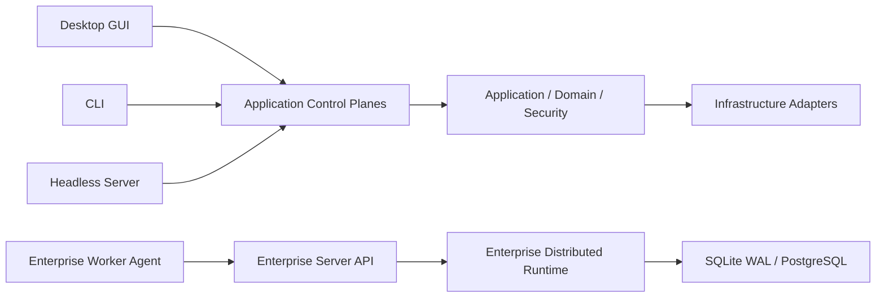
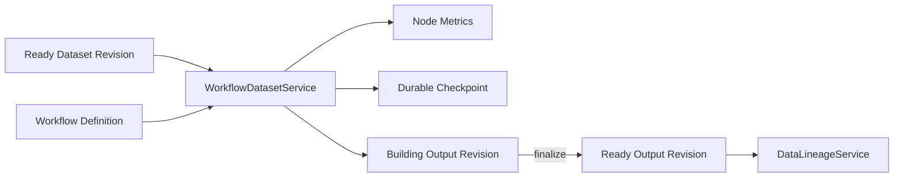

# Arenyxa v0.1 Architecture

> This document describes the **Arenyxa v0.1 candidate source tree**, derived from engineering baseline **v8.2.0**. Current status is **community unsigned, NOT READY FOR RELEASE**. Source ownership and tests are evidence for specific contracts; native platform behavior and release readiness require separate recorded validation.
> Important statements are tied to real modules, classes, call paths, or runtime constraints. Historical V6.x/V7.x evolution is treated only as background.

## 1. Scope and Authoritative Sources

This document covers the Desktop GUI, CLI, Headless Server, Enterprise Server/Worker runtime, network capture, workflow execution, persistence, security, Windows platform boundaries, Repair Center, and release/runtime lifecycle.

Primary architecture authorities in the source tree are:

- `src/arenyxa/architecture_contracts.py`: dependency rules, component ownership, failure rules, and compatibility contracts.
- `src/arenyxa/bootstrap.py`: Desktop `ApplicationContext` construction, runtime ownership, startup, and shutdown ordering.
- `src/arenyxa/application/*_control_plane.py`: shared application services used by GUI, CLI, and server surfaces.
- `src/arenyxa/enterprise/distributed_*.py`: Enterprise Queue, Worker, Lease, and SQLite/PostgreSQL distributed runtime.
- `src/arenyxa/presentation/`: Qt/PySide shell, pages, navigation, theme, motion, and window lifecycle.
- `src/arenyxa/repair*.py`: startup diagnostics, repair planning, independent Repair Worker execution, and recovery.

Core principle: **Presentation does not own durable truth. Application owns use cases and control planes. Domain/Security define rules. Infrastructure and Enterprise Runtime perform I/O, network operations, and persistence.**
## 2. Executable Entry Points and Runtime Surfaces

`pyproject.toml` defines the main runtime entry points:

| Surface | Entry | Primary Owner | Purpose |
|---|---|---|---|
| Desktop GUI | `arenyxa-gui -> arenyxa.app:main` | `app.py`, `bootstrap.py`, `presentation.MainWindow` | Full local workstation; owns an `ApplicationContext` |
| Unified CLI | `arenyxa` / `arenyxa-cli -> arenyxa.cli:main` | `cli.py` | Command-line control surface |
| Headless Server | `arenyxa-server -> arenyxa.infrastructure.server:main` | `infrastructure/server.py` | FastAPI service, defaulting to `127.0.0.1:8787` |
| Windows Service | `arenyxa-windows-service` | `infrastructure/windows_service.py` | Windows SCM service entry |
| Crawler MCP | `arenyxa-crawler-mcp` | `application/crawler_mcp.py` | Crawler/MCP automation entry |
| Enterprise Worker | Worker script / Agent runtime | `enterprise.worker_agent` | Authenticated HTTPS lease consumer |


```mermaid
flowchart LR
  GUI[Desktop GUI] --> CP[Application Control Planes]
  CLI[CLI] --> CP
  API[Headless Server] --> CP
  CP --> CORE[Application / Domain / Security]
  WORKER[Enterprise Worker Agent] --> EAPI[Enterprise Server API]
  EAPI --> ERUNTIME[Enterprise Distributed Runtime]
  CORE --> INFRA[Infrastructure Adapters]
  ERUNTIME --> ESTORE[SQLite WAL / PostgreSQL]
```
## 3. Layering, Dependency Direction, and Forbidden Edges

`architecture_contracts.py` turns the intended layer structure into auditable source rules:

```text
Presentation (arenyxa.presentation.*)
        ↓ user intent / view models
Application (arenyxa.application.*)
        ↓ use cases / control-plane orchestration
Domain / Security / Enterprise contracts
        ↓ validated operations
Infrastructure + Enterprise Runtime adapters
        ↓
SQLite / PostgreSQL / HTTP / Browser / Packet / Windows APIs / Filesystem
```

Enforced dependency restrictions:

- `domain` must not depend on `application`, `infrastructure`, or `presentation`.
- `application` must not depend on `presentation`.
- `infrastructure` must not depend on `presentation`.
- `presentation` must not directly import `arenyxa.infrastructure.database`.
- Hiding a control, disabling a menu, or omitting a page is **not authorization**; protected operations must be re-authorized at the Security/Application boundary.

`validate_dependency_rules()` scans Python imports through the AST and reports violations. Presentation may hold service references supplied through `ApplicationContext`, but it must not create a parallel persistence or authorization model.
## 4. Desktop Startup Path: Process Entry to MainWindow

The Desktop runtime is driven by `arenyxa.app:main`:

```text
app.main
  → select_runtime / validate_python_for_runtime
  → AppPaths.discover + paths.initialize
  → active Repair Worker check
  → Qt binding preflight
  → QApplication
  → SingleInstance.acquire
  → DataRootLease.acquire
  → load startup locale/settings + launch geometry
  → show ArenyxaShellWindow
  → bootstrap(...)
  → mandatory Root Owner gate on registered Root workstations
  → MainWindow(context)
  → shell_window.attach_main_window
  → deferred StartupHealthScanner
  → QApplication event loop
  → finalize_runtime
  → ApplicationContext.shutdown + DataRootLease.release
```

`SingleInstance` prevents ordinary duplicate Desktop instances. `DataRootLease` prevents Desktop, Headless Server, and Repair Center from concurrently mutating the same data root. If the required Qt binding is unavailable, startup enters the Repair path rather than continuing into a partially constructed UI.

`ArenyxaShellWindow` is the startup/recovery shell. It becomes visible before the full workspace is committed, then hosts the real `MainWindow`. If `MainWindow` construction fails, the application must shut down the already-created context and release the data-root lease before reporting failure.
## 5. `ApplicationContext`: Desktop Runtime Ownership Graph

`bootstrap.ApplicationContext` owns the initialized Desktop service graph.

| Area | Context Field / Instance | Implementation |
|---|---|---|
| Local persistence | `store: SQLiteStore` | `infrastructure.database` |
| Task/Run execution | `runner` | `application.runner` / `application.async_runner` |
| Scheduling | `scheduler` | `application.scheduler` |
| Workflow/Data | `workflows`, `workflow_runtime`, `lineage`, `versioning` | `application.workflows`, `workflow_runtime`, `data_lineage`, `versioning` |
| Capture | `capture` | `infrastructure.capture.controller` |
| Proxy/MITM | `proxy_engine`, `mitm_engine` | `infrastructure.capture.proxy`, `mitm_engine` |
| Security | `security`, `local_control_session` | `security.SecurityKernel` |
| Enterprise | `enterprise_identity`, `enrollment`, `enterprise_governance`, `enterprise_server` | `arenyxa.enterprise.*` |
| Control planes | `control_plane`, `traffic_control`, `enterprise_control`, `windows_runtime` | `application.*_control_plane` |
| Long-running work | `job_system` | `application.job_system` |
| Reliability | `runtime_supervisor`, `survivability`, `performance_telemetry` | `application.runtime_supervisor`, `survivability`, `performance_telemetry` |
| Developer tools | `terminal`, `terminal_workspace`, `command_runtime` | `application.terminal*`, `command_runtime` |

`bootstrap()` creates storage/recovery first, then Security/Enterprise, then Runner/Workflow/Capture, and finally attaches Proxy/MITM, Runtime Supervisor, Survivability, telemetry, and control planes. Presentation receives the fully assembled context; it does not bootstrap these subsystems itself.
## 6. Shared Control-Plane Boundaries

### `PlatformControlPlane`

`application/control_plane.py` owns platform health, diagnostic exports, Job System access, Survivability, Performance Telemetry, Enterprise status, and Windows runtime operations. Protected calls use `SecurityKernel.require()` and carry the entry `surface` into the authorization context.

### `TrafficControlPlane`

`application/traffic_control_plane.py` unifies Capture, packet analysis, protocol registry access, Proxy, MITM, and network exports. It owns path confinement, query-size limits, protocol decode budgets, export-root restrictions, and Job System handoff for long-running analysis.

### `EnterpriseControlPlane`

`application/enterprise_control_plane.py` exposes Enterprise identity/governance/enrollment, Worker management, distributed jobs, lease recovery, and audit projections. It does not manufacture Enterprise authority; sensitive operations remain subject to `LocalEnterpriseIdentityService.require()` and `require_recent_step_up()`.

### `WindowsRuntimeControl`

`application/windows_runtime.py` is the capability façade for Windows-native qualification and control, including ETW, WFP, Npcap, SCM/Event Log, and related runtime probes. An unavailable capability must be reported explicitly as unavailable rather than represented as a successful operation.

## 7. Persistence Boundaries: Local SQLite vs. Enterprise Distributed Storage

Arenyxa has two distinct persistence envelopes. The Desktop/Headless primary database is `SQLiteStore`, which stores Task, Run, Capture, Workflow, Dataset, Settings, and Platform Job state. Enterprise distributed execution uses `DurableDistributedQueue` with a separate `DistributedRuntimeStorageBackend` for Workers, distributed jobs, leases, checkpoints, and queue events.
The default Enterprise queue target is `<data_root>/enterprise/distributed.sqlite`. Passing an Enterprise runtime database/DSN during bootstrap replaces that embedded target with PostgreSQL.

`storage_backend_for()` currently selects backends as follows:

- `postgresql://...` or `postgres://...` → PostgreSQL.
- Valid libpq keyword conninfo such as `user=... dbname=... host=...` → PostgreSQL.
- Ordinary filesystem paths, including valid filenames containing `=`, → SQLite.

The distributed SQLite backend uses WAL and serialized local writers. PostgreSQL is the multi-host concurrent-writer backend and provides row locking, `SKIP LOCKED`, bounded connection pools, and dedicated hot-path SQL. The two backends share queue semantics but not transaction implementation.

## 8. Enterprise Distributed Queue State Machine

The queue owner is `enterprise.distributed_queue.DurableDistributedQueue`; state/protocol constants live in `enterprise.distributed_protocol`.

| State | Meaning | Principal Entry Path |
|---|---|---|
| `queued` | Available for Worker admission | `enqueue`, retry, handover, recovery |
| `leased` | Bound to Worker + lease token + expiry | `lease_next` / `lease_many` |
| `running` | Worker confirmed execution start | `start_job` |
| `completed` | Successful terminal state with receipt | `complete` |
| `failed` | Non-retry terminal failure | `fail` / exhausted recovery |
| `review_required` | Unsafe to auto-retry after non-idempotent effects | fail/handover/recovery |
| `cancelled` | Explicit terminal cancellation | management/recovery paths |

Lease plaintext is returned only to the Worker; durable storage keeps `lease_token_sha256`. An active lease requires a valid active state, Worker ID, token digest, and positive expiry. Terminal rows must clear active lease fields.
`distributed_workers.active_leases` is a redundant counter and must match the number of that Worker's `leased`/`running` jobs. `reconcile_durable_state()` repairs counter drift and illegal lease rows after interrupted or inconsistent execution.

## 9. PostgreSQL Queue Hot Paths and Connection Pool

Each `PostgreSQLDistributedRuntimeStorage` instance owns one `psycopg_pool.ConnectionPool`. Current production sizing is eight warm connections with a maximum of eight. Checkout timeout is 15 seconds, connection establishment timeout is 10 seconds, maximum idle time is 300 seconds, and maximum connection lifetime is 1800 seconds.

Physical connections receive `lock_timeout=10s`, `statement_timeout=60s`, and `idle_in_transaction_session_timeout=60s`. Returned connections record an Arenyxa idle timestamp. The checkout health callback prefers socket-readiness inspection and performs a lightweight SQL probe only for suspicious I/O, first use, or connections idle for at least five seconds.
Successful PostgreSQL hot paths run as one CTE statement under pool `autocommit=True`:

- `lease_next_fast_sql()` performs Worker admission, candidate selection, lease update, and event creation.
- `start_job_fast_sql()` performs a conditional update fenced by job ID, state, Worker ownership, lease proof, and expiry, then records the start event.
- `complete_fast_sql()` locks the candidate, writes terminal result state, decrements the Worker slot, and records the completion event.

If a fast path returns no row, the queue falls back to the portable path so precise errors such as unknown/revoked Worker, stale lease, and expired lease remain observable.

Queue database connections are checkout-per-method. A public queue operation releases its connection before application/business execution continues. `EnterpriseWorkerRuntime` therefore does not hold a PostgreSQL queue connection while the local `RunOrchestrator` executes task work; lease renewal uses separate short checkouts.

### PostgreSQL Close Boundary

`PostgreSQLDistributedRuntimeStorage.close(timeout=None)` moves lifecycle state from `open` to `closing`, stops new admissions, drains already-admitted connections, and only then closes the pool. An explicit timeout bounds the wait for stuck callers so application shutdown cannot block indefinitely on `_active_connections`.
## 10. Enterprise Worker Execution Path

Local distributed execution is owned by `EnterpriseWorkerRuntime`; the persistent remote control loop is owned by `EnterpriseWorkerAgent`.

```text
EnterpriseWorkerAgent
  → authenticate and heartbeat
  → request a bounded lease batch
  → convert response to DistributedLease
  → ThreadPoolExecutor(max_workers=max_slots)
  → EnterpriseWorkerRuntime.execute_lease
      → verify Worker ownership
      → persist the immutable Task snapshot locally
      → queue.start_job
      → optional non-idempotent side-effect fence
      → runner.submit(Task)
      → keepalive thread renews the lease
      → progress callback persists checkpoints
      → successful Run: queue.complete
      → failed Run: queue.fail
```
The remote Agent uses `_RemoteQueueAdapter` to map lifecycle operations onto Enterprise Server endpoints. Session refresh and temporary transport recovery are handled inside the Agent control loop with bounded retry/backoff behavior.

Agent stop/restart is isolated by `_AgentGeneration`. A retired generation is detached and drained; a replacement generation receives a new executor. When explicit cancellation of running work is requested, active leases are handed over where possible before cancellable futures are cancelled.

## 11. Lease Fencing, Idempotency, and Recovery

Distributed execution uses Worker ownership, lease ownership, and terminal receipts as separate fences:

- `start_job` succeeds only while the same Worker still owns a valid unexpired lease.
- `renew_lease` revalidates ownership before extending expiry and refreshing Worker heartbeat.
- `complete` stores terminal Worker identity, terminal lease proof, completion time, and result hash.
- An exact terminal replay from the same ownership/result tuple is idempotent.
- A conflicting terminal replay is rejected.
- A stale or expired lease cannot overwrite a job whose ownership has changed.
- A non-idempotent job that has already crossed its side-effect fence moves to `review_required` when automatic retry would be unsafe.

Recovery is divided into `recover_expired_leases()`, `recover_stale_worker_leases()`, and `reconcile_durable_state()`. PostgreSQL recovery candidates use row locking with `SKIP LOCKED`, allowing multiple recovery actors to make progress without serializing the entire queue.
## 12. PostgreSQL P99 Verification Contract

P99 is a release-verification contract for the Enterprise Distributed Runtime. It must not be achieved by weakening the benchmark or durability configuration.

The authoritative workload is fixed at 64 workers, 128 concurrency, 1024 jobs, and 16 independent clients.

A valid run records completed/non-completed jobs, errors, remaining active leases, fencing results, pool acquisition/reconnect failures, throughput, P50/P95/P99/MAX, and PostgreSQL identity/configuration.

Candidate comparisons must preserve the PostgreSQL server/configuration, Python runtime, dependencies, benchmark semantics, workload shape, and host environment. Each run uses a fresh database. Runtime source identity and imported bytecode identity must be verified. Slow or failed runs are never discarded.

A PostgreSQL-labeled integration test must prove that the selected backend is actually PostgreSQL; an accidental SQLite fallback is not a PostgreSQL pass. Concrete benchmark values and closure decisions belong in dedicated evidence reports rather than permanent architecture claims.
## 13. Task and Run Execution

`RunOrchestrator` and `AsyncRunOrchestrator` own Task execution. Desktop bootstrap selects the implementation for the active runtime tier.

The normal pipeline is: Task snapshot → bounded execution → fetch/parse/extract → validation/deduplication → bounded result batches → `SQLiteStore` transaction → durable Run state.

`PerformancePolicy` resolves concurrency and batching limits. `ResourceGovernor` may reduce admission under resource pressure without changing durability, security, or integrity rules.
## 14. Workflow, Dataset Revision, and Data Lineage

Workflow execution reuses the existing `WorkflowEngine`; `WorkflowDatasetService` applies a workflow to a Dataset Revision and owns checkpoint/output consistency.


```mermaid
flowchart LR
  SRC[Ready Dataset Revision] --> EXEC[WorkflowDatasetService]
  WF[Workflow Definition] --> EXEC
  EXEC --> NODE[Node Metrics]
  EXEC --> CKPT[Durable Checkpoint]
  EXEC --> BUILD[Building Output Revision]
  BUILD -->|finalize| READY[Ready Output Revision]
  READY --> LINEAGE[DataLineageService]
```

Revision lifecycle is `building → ready`, with `interrupted`, `failed`, and `cancelled` representing non-published outcomes. Normal consumers should treat only `ready` revisions as published data.

`RuntimeRecoveryService` audits active Runs/Captures/Workflows, building Revisions, invalid schedules, and damaged resume metadata during bootstrap. Recoverable work remains explicitly resumable; inconsistent definition hashes or missing source/output revision relationships are failed rather than presented as completed.

Lineage stores bounded structural nodes and edges. It does not copy raw captured bodies, cookies, authorization material, or other secret-bearing payloads into lineage metadata.
## 15. Network Capture, Proxy, MITM, and Protocol Intelligence

`CaptureController` owns capture lifecycle. `TrafficControlPlane` is the shared application façade used by presentation and external surfaces.

```text
Browser / HAR / Native / System adapters
  → CaptureController
  → bounded event queue and batches
  → NetworkEvent compatibility envelope
  → normalized Flow / HTTP / DNS / TLS / WebSocket records
  → SQLite transaction
  → LiveIntelligencePipeline / UI / Replay / API Map
```

A saturated capture queue must expose dropped-event accounting rather than silently claiming a complete capture. Large payloads use bounded body handling and content-addressed body references instead of unrestricted SQLite storage.

`InterceptingProxy` and `MitmEngine` are owned by `ApplicationContext`; management and export operations pass through `TrafficControlPlane`. Proxy history is paged and bounded. Network-analysis inputs are confined to configured Projects/Captures roots, and traffic exports are confined to the configured Exports root.

Protocol decoding has an explicit payload budget. External packet tooling is an optional capability boundary; its absence degrades the relevant external analysis path without redefining the rest of the Network Core as unavailable.
## 16. Runtime Policy Model

Runtime policy decisions are centralized outside the presentation layer. The UI does not become the source of truth for permission-sensitive operations.
Policy state, capability definitions, audit records, and key-protection adapters have separate owners under `arenyxa.security`. Enterprise administration remains a distinct boundary from ordinary local workstation authority. Application services re-check protected operations before execution instead of trusting navigation state or widget visibility.

## 17. Desktop UI Shell and Presentation Boundary

The Desktop surface is not a single raw `QMainWindow` startup path. The visible hierarchy is:

```text
ArenyxaShellWindow
  ├─ startup / bootstrap / recovered-session presentation
  └─ attached MainWindow
       ├─ Navigation GlassPanel
       ├─ Top Command Bar
       ├─ QStackedWidget workspace
       ├─ Context Inspector
       ├─ StatusBar
       └─ tray / shortcuts / overlays
```

`MainWindow` delegates navigation, operations, and lifecycle behavior to `main_window_navigation.py`, `main_window_operations.py`, and `main_window_lifecycle.py`. Page metadata and navigation groups are centralized in `main_window_registry.py`; page instances are created through `NavigationResolver` and `PageFactory` and cached rather than rebuilt for theme changes.

The Sidebar is 236 px in expanded mode. Core pages occupy the scrollable navigation body, while system destinations are kept in the footer. A single `QButtonGroup` maintains visual page selection.
The visual system is coordinated by `ThemeManager`, `GlassPanel`, `MotionOrchestrator`, `ThemeTransitionController`, and `InterfaceScaleManager`. `animation_mode`, Reduce Motion, system motion preference, high-contrast mode, and performance mode can reduce or disable non-essential effects.

Glass, blur, motion, and theme transitions are presentation concerns only. They must not change route authority, Task/Run state, database transaction semantics, or Enterprise runtime decisions.

## 18. Repair Center vs. Runtime Recovery

These are separate recovery mechanisms.

### Runtime Recovery

`application.runtime_recovery.RuntimeRecoveryService` runs inside normal bootstrap. It reconciles durable lifecycle state left by an interrupted process: active Runs/Captures, active Workflows, building Revisions, invalid schedules, and invalid resume metadata. It repairs **runtime data state**; it does not replace program files.

### Repair Center

`repair_scanner.StartupHealthScanner` detects installation/runtime problems and `repair_engine.RepairEngine` performs selected repair actions in an independent repair process.

```text
Desktop detects issue
  → create RepairPlan
  → launch independent Repair Worker
  → main process exits
  → Repair Worker waits for parent exit
  → acquire DataRootLease exclusively
  → backup affected state
  → execute selected repair actions
  → final health verification
  → write last_repair_report.json
  → optional relaunch
```
Program-file recovery uses only the current release's verified offline repair payload or repair seed. Paths remain confined to the installation root and restored files are verified by SHA-256. Database repair creates backups first; a rebuilt SQLite database must pass `quick_check` before it can replace the active database, and the original damaged file is preserved under a unique name.

Repair preserves Projects, Captures, Exports, and other durable user data unless an explicit operation defines otherwise.

## 19. Windows Platform and Compatibility Boundary

Modern Windows behavior is isolated behind `platform_compat.py`, `qt_compat/`, and platform-specific services.
| Capability | Primary Owner |
|---|---|
| SCM / Windows Service | `infrastructure.windows_service` |
| ETW / WFP / Npcap qualification | `application.windows_runtime` |
| DPAPI / CNG / TPM protection | `security.key_protection`, `security.hardware_*` |
| ConPTY | `application.windows_conpty` |
| Windows taskbar integration | `presentation.taskbar` |
| Native visual capability and theme integration | presentation theme/platform helpers |

The modern package contract targets Python 3.11–3.13 with PySide6. The Windows 7 Legacy lane is NOT TESTED for this candidate and is isolated through `requirements-win7.txt`, compatibility shims, a dedicated PyInstaller spec, and a dedicated installer definition while reusing the same core Domain/Application/Infrastructure implementation.

Legacy runtime disables or simplifies unsupported modern visual/runtime capabilities. Native Windows 7 qualification must be performed on a real Windows 7 SP1 x64 VM or machine; static analysis on a modern OS is not a substitute for that release gate.

## 20. Developer Terminal, Plugins, and Headless Server

`TerminalSession` belongs to the Application layer rather than QWidget code. Its working directory is confined to the Projects root, execution modes are explicit, and read-only SQL inspection uses a read-only database connection.
Plugins are discovered by `PluginManager`; compatibility and isolation are handled by the plugin runtime/sandbox boundary. Plugin failure must remain isolated from host lifecycle and durable application state.

The Headless Server does not construct the full Qt Desktop `ApplicationContext`. `infrastructure.server._build_server_services()` independently creates `AppPaths`, `DataRootLease`, `SQLiteStore`, `RuntimeRecoveryService`, `AsyncRunOrchestrator`, `SecurityKernel`, `JobSystem`, `WindowsRuntimeControl`, and `PlatformControlPlane`.

The server binds to loopback by default. Non-loopback binding requires explicit operator intent. API authentication is converted into short-lived application sessions, and endpoints continue to use capability checks rather than treating transport authentication as unlimited authority.

## 21. Shutdown Dependency Order

`ApplicationContext.shutdown(reason="unspecified", timeout=10.0) -> bool` uses one `ShutdownDeadline` per attempt. It first stops scheduler, runner and Job System intake and requests workflow cancellation, then drains those producers. Ownership includes submissions still in authorization/persistence and retirement callbacks; a completed Future alone is insufficient.

After producer drain, `DependencyShutdownCoordinator` follows its registered dependency graph: monitor/scheduler owners precede the Job System and Enterprise/Office/Workflow work; Capture and Proxy/MITM precede runner resource release; terminal and identity/session consumers precede settings, database maintenance and logging. The authoritative order is the coordinator registration in `bootstrap.py`, including independent resilience-monitor cleanup.

A timeout, exception or false result preserves incomplete ownership and blocks dependent cleanup; independent steps may still run within the remaining budget. Successfully completed steps are retained for a later retry. The application finalizer releases the data-root lease and clears the recovery marker only after background work and context shutdown succeed; an incomplete window close does not accept the close event.

Known executor, callback, registration and monitor waits use bounded contracts. Some synchronous external/native close APIs (for example a fetcher or capture adapter with no timeout interface) can still block arbitrarily; the source does not establish a universal wall-clock bound over such third-party behavior. Hiding a window or returning from an offscreen test is not evidence of complete runtime shutdown.

Any new long-lived component must define its owner, start point, stop operation, dependency order, retry behavior, and exact position in `ApplicationContext.shutdown()`.

## 22. Failure Classification and System Response

`architecture_contracts.FAILURE_RULES` defines the common failure model:

| Category | Default Disposition | Required Invariant |
|---|---|---|
| transient | bounded retry | Retry is cancellable and idempotency-aware |
| recoverable | rollback + recover | Restore the last durable invariant before success is exposed |
| configuration | reject | Reject before side effects and explain the invalid input |
| permission | reject | Authorization remains a backend decision |
| corruption | stop mutation and preserve diagnostics | Use only a verified recovery path |
| fatal | fail closed | Finalize owned resources and preserve evidence |

A degraded survivability state is not permission to ignore failures. Resource pressure may reduce admission or non-critical work, but it must not weaken durable state rules, queue ownership, audit semantics, or integrity verification.

## 23. Architecture-Level Invariants

The following invariants should remain continuously testable and release-gated:

- Durable success is exposed only after the relevant commit or atomic replacement succeeds.
- Presentation never becomes the source of truth for persistence or authorization.
- Enterprise Worker business execution does not hold a queue database connection for the duration of the application task.
- Old or expired lease ownership cannot overwrite newer ownership.
- Exact terminal replay may be idempotent, while conflicting terminal ownership/result state is rejected.
- Repair Center and normal Desktop/Server runtimes are mutually exclusive on the same data root.
- Root workstation authority and Enterprise administrative authority remain separate trust boundaries.
- Queue backend identity must be explicit; PostgreSQL verification cannot silently run on SQLite.
- Capture backpressure, resource pressure, and reduced-function modes must remain observable rather than silently dropping correctness guarantees.
- Shutdown must drain owned runtime resources before final storage maintenance.

## 24. Compatibility and Release Identity

Current public display identity is `0.1`; package/distribution identity is `0.1.0`, and PE metadata is `0.1.0.0`. Engineering baseline `v8.2.0` is retained separately. `pyproject.toml` declares Python `>=3.11,<3.14` for the modern package. Plugin/runtime compatibility remains `6.8.0`; this product identity change does not alter database, workflow or Enterprise wire schemas. See [VERSIONING.md](../VERSIONING.md).

Plugin API compatibility remains a separately versioned contract and must not be inferred from the application display version. Packaging artifacts, installer resources, Repair payloads, Windows qualification, and benchmark evidence are release-gate concerns layered on top of this runtime architecture.

## 25. Historical Evolution

Earlier V6.x/V7.x releases introduced many of the capabilities that remain present today: normalized network capture, Replay/API Map, Dataset lineage, Workflow execution, adaptive concurrency, startup recovery, legacy Windows compatibility, and motion/theme infrastructure.

Those version-by-version implementation notes are useful historical context, but they are not the authoritative description of the v0.1 candidate runtime. For current engineering work, use the current owners, call paths, storage boundaries, lifecycle rules, and invariants defined above and verify them against the source tree.
